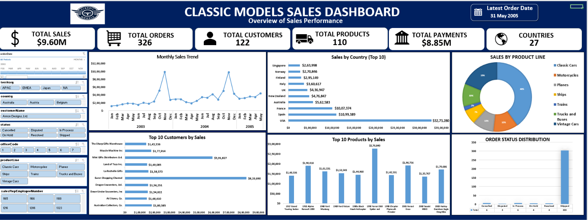
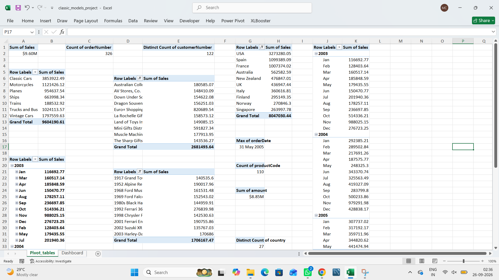
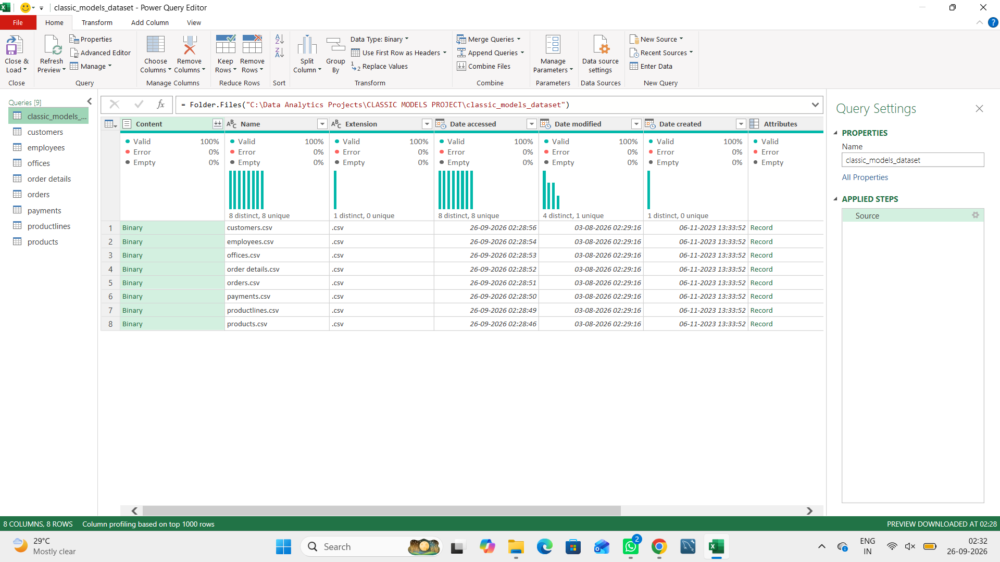

# Classic Models — Sales Data Analysis & Dashboard

## Project Overview
This project analyzes the Classic Models sales dataset using Microsoft Excel. It includes raw datasets, Pivot Table-based analysis, and an interactive-style dashboard to present sales-related insights.

## Project Objectives
- Organize and analyze sales data.
- Summarize data using Excel Pivot Tables.
- Present key metrics and trends through an Excel dashboard.
- Practice data analysis and visualization using Microsoft Excel.

## Tools & Technologies
- Microsoft Excel
- Power Query Editor
- Excel Pivot Tables
- Excel Dashboard

## Dataset
The project uses the following datasets:
- Customers
- Employees
- Offices
- Order Details
- Orders
- Payments
- Product Lines
- Products

## Project Workflow
1. Imported the raw CSV datasets into Excel using Power Query Editor.
2. Used Excel Pivot Tables to summarize and analyze the data.
3. Created a dashboard to visualize the analysis.

## Project Screenshots

### Dashboard

### Pivot Tables

### Power Query Editor

## Project Files
- `classic_models_project.xlsx` — Excel workbook containing the analysis and dashboard.
- Raw CSV datasets — Source data used in the project.
- `Screenshots/` — Visual previews of the project.

## Key Learning
This project provided practical experience in organizing datasets, analyzing sales information using Pivot Tables, and presenting results through an Excel dashboard.

---
Created as a Microsoft Excel Data Analytics portfolio project.
